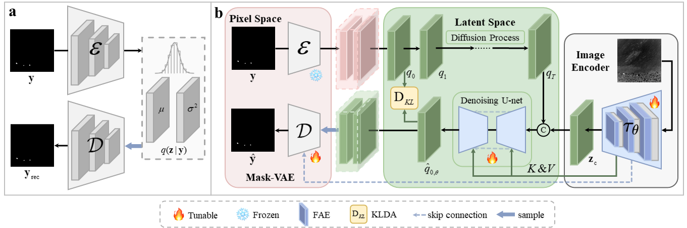

# LGLDNet
The official repository for "A LABEL-GUIDED LATENT DIFFUSION NETWORK FOR INFRARED SMALL TARGET DETECTION"
## Overall Framework

## Contributions
- We propose LGLDNet, the first Latent diffusion model applied to IRSTD, where the diffusion model is trained to predict the latent posterior of ground truth, making the decoder exploit richer deep latent features beyond mere skip connections.
- We introduce KLDA, which aligns the predicted distribution to the latent posterior of ground truth, reducing the difficulty of learning the target distribution and providing the decoder with purer samples.
- We design FAE that automatically decomposes features into high- and low-frequency bands and selectively enhances cues for small target while suppressing background clutter.
- Extensive experiments on IRSTD-1k and NUDT-SIRST demonstrate that IRSTD-LDM outperforms state-of-the-art IRSTD methods.
## Recommended environment
Create an environment by the following methods:
```bash
conda env create -f environment.yaml
```
## Usage — `main.py`

`main.py` accepts a configuration argument `--base` (path to a YAML config) and a boolean `--train` flag. Below are minimal example commands.

### 1) Train Mask-VAE (pretrained Mask-VAE for [IRSTD-1k](https://drive.google.com/file/d/18alU2uTodp9Sgf-7fIuW6XQDrOqpafIE/view?usp=drive_link) and [NUDT-SIRST](https://drive.google.com/file/d/1v9PWkcjv7WsEaHhxIIJRehxUP6thae_X/view?usp=drive_link))

This runs training with the Mask-VAE configuration.

```bash
python main.py --base configs/autoencoder/autoencoder_kl_32x32x4.yaml --train True
```

### 2) Test Mask-VAE

Run with the same base config but set `--train False`.

```bash
python main.py --base configs/autoencoder/autoencoder_kl_32x32x4.yaml --train False
```

### 3) Train Diffusion model

This uses the diffusion configuration for full LGLDNet training.

```bash
python main.py --base configs/latent-diffusion/diffusion.yaml --train True
```

### 4) Test Diffusion model

```bash
python main.py --base configs/latent-diffusion/diffusion.yaml --train False
```
## Results and Trained Models
#### Qualitative Results


#### Quantative Results 
| Dataset   | mIoU (x10(-2)) | Pd (x10(-2))|  Fa (x10(-6)) |F1 (x10(-2))||
|-----------|:--------------:|:-----:|:-----:|:-----:|:-----:|
| IRSTD-1k  |     67.17      |  93.54 |16.55|80.36|
| NUDT-SIRST |     95.20      |  99.15 | 3.29 |97.54|

This code is highly borrowed from [latent-diffusion](https://github.com/YimianDai/open-acm). Thanks to 
CompVis.
